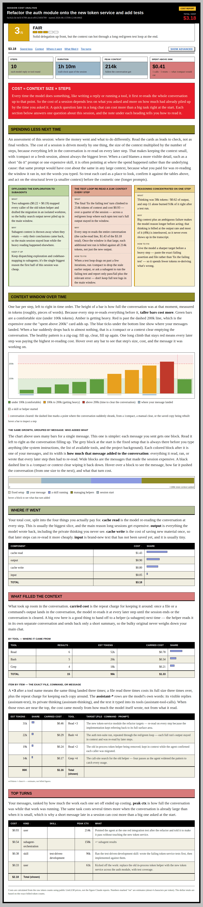

# cc-cost-meter

A [Claude Code](https://claude.com/claude-code) skill that explains where a session's tokens
and dollars went. It splits the spend by token type, model, turn, and subagent, names what
filled the context window, and renders an interactive HTML report.

Costs are recomputed from raw token counts times LiteLLM per-token prices, not read from
Claude's reported totals, so every number is itemized and auditable. Pure Node stdlib: no
install, no dependencies, and it runs offline against a bundled price snapshot.

[See a live sample report](https://michalschroeder.github.io/cc-cost-meter/): the full
interactive HTML for a mock session (context timeline, per-turn spend, thinking breakdown, grade).

<p align="center">
  <a href="https://michalschroeder.github.io/cc-cost-meter/">
    
  </a>
</p>

## What it answers

- Why was this session expensive? What was the single biggest lever?
- Which files / commands / prompts filled the context window (and the carried re-read cost)?
- How much did reasoning (thinking tokens) cost, and which prompts drove it?
- How much did each skill dispatch / subagent / model cost?
- Where would a single `/compact` have paid off most, and how much would it have saved?
- What's the overall grade (1 to 5) for spending efficiency? The grade is anchored to a computed
  avoidable-share band shown under the badge, and past grades show up in `list` output.

## Usage

As a Claude Code skill:

```
/cc-cost-meter                         # list recent sessions, ask which to analyze
/cc-cost-meter 848c5b25                # detail report for a session (by id prefix)
/cc-cost-meter 848c5b25 --no-assess    # skip the grading subagents (auto when cost < $0.50)
/cc-cost-meter list --last 20          # rank recent sessions by cost (+ recorded grades)
/cc-cost-meter 848c5b25 --config-dir ~/.claude-other
```

A detail run prints a fixed cost-story skeleton inline (cost split, top context consumers, best
compact point, grade) and writes `session-cost-<shortid>.html` to the current directory.
Subagents write the turn labels, consumer labels, and the 1 to 5 "Spending less next time"
assessment from bundled prompts. Everything else is computed.

Or drive the analyzer directly (JSON output, no model needed):

```bash
cd skills/cc-cost-meter
node scripts/analyze.js list --last 10                 # recent sessions + period totals
node scripts/analyze.js <session-id-prefix>            # full per-session cost breakdown
```

Flags: `--config-dir <path>` (transcript root, default `~/.claude` or `$CLAUDE_CONFIG_DIR`),
`--last N` / `--since YYYY-MM-DD` (list mode), `--out <path>` (report path, skill /
`render-report.js` only), `--no-assess` (skill only).

## Install

The skill lives in [`skills/cc-cost-meter/`](skills/cc-cost-meter). Copy that directory into
your Claude Code skills location, then invoke `/cc-cost-meter`:

```bash
cp -r skills/cc-cost-meter ~/.claude/skills/        # or a project's .claude/skills/
```

## Layout

- `skills/cc-cost-meter/`: the skill. Copy this into your skills location.
  - `SKILL.md`: the skill definition and workflow. Start here.
  - `scripts/analyze.js`: self-contained JSON analyzer. `grader-view.js` trims the payload
    for subagents, `apply-summaries.js` merges the model-written copy, `render-report.js`
    produces the HTML.
  - `scripts/lib/`: the cost engine (transcript parsing, per-call cost math, aggregation,
    compaction what-if, grade history).
  - `references/`: the subagent prompts (turns, consumers, grader, critic).
  - `data/model_prices.json`: bundled LiteLLM price snapshot, the offline default.
  - `assets/report-template.html`: the HTML report template. `assets/mock-detail.json` is the
    demo payload behind the [sample report](https://michalschroeder.github.io/cc-cost-meter/).
    Run `node scripts/render-report.js --mock --out ../../docs/index.html` to regenerate it.
  - `REFERENCE.md`, `EVALUATION.md`, `DESIGN.md`: cost model, grading rubric, design notes.
  - `evals/`: grading reproducibility evals. See its README.

## Tests

```bash
node --test skills/cc-cost-meter/scripts/test/*.test.js
node skills/cc-cost-meter/scripts/render-report.js --mock --out /tmp/mock.html   # template preview
```

The skill appends each grade to `grades.jsonl` under `$XDG_STATE_HOME/cc-cost-meter/` (default
`~/.local/state/cc-cost-meter/`), one subdir per `--config-dir` profile.

## License

MIT. See [LICENSE](LICENSE).
